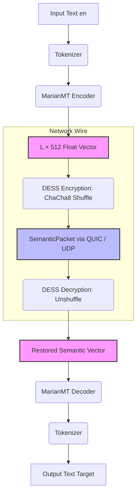

# 🏛 New Babylon — Aetheris Semantic Protocol (ASP)

**Aetheris Semantic Protocol (ASP)** is a cutting-edge, AI-powered networking protocol designed for instantaneous, secure, and cross-lingual knowledge transfer across international teams.

Unlike traditional translation tools or cloud services that transmit raw text or audio, ASP encodes information directly into **latent state vectors (semantic embeddings)**. The network does not carry natural language — it transmits **pure meaning**. 

The sender encodes the input using the `MarianMT` encoder (`Candle` framework), obfuscates it via **DESS** (Dynamic Embedding Space Shuffling), and streams it over **quiche** (QUIC/UDP) in a high-efficiency **FlatBuffers** format. The recipient decrypts the vector and decodes it directly into their native tongue.

---
## ⚡ Why ASP is Not Just Another Translator

ASP introduces a paradigm shift in secure communications. By eliminating language from the wire, it solves the fundamental vulnerabilities of traditional translation architectures:

* **Zero-Text Networking**: Traditional engines (e.g., Google Translate, DeepL) require text to exist in transit, leaving it vulnerable to interception. ASP completely eradicates natural language from the network layer.
* **Paradigm Disruption**: Instead of relying on centralized cloud infrastructure that logs and scans user text, ASP operates strictly on-device. The data payload over the wire is natively unintelligible to any intermediary entity.

### Architectural Comparison

| Feature | Legacy Cloud Translators (Google / DeepL) | Aetheris Semantic Protocol (ASP) |
| :--- | :--- | :--- |
| **Privacy & Sovereignty** | ❌ Centralized cloud processes and views raw text | ✅ **Absolute Privacy.** Source text never leaves the local device |
| **Offline Autonomy** | ❌ Requires active internet/API connection | ✅ **100% Offline Capable.** Fully decentralized edge execution |
| **Latency Profile** | ❌ 200ms – 800ms (Network + API overhead) | ✅ **~175ms** (Deterministic local inference) |
| **SIGINT / Intercept Resistance** | ❌ Raw text payload is readable if TLS is breached | ✅ **Immune.** Intercepted payloads are raw, shuffled `float` arrays |
| **Operational Cost** | ❌ Scaled API pricing ($20–$25 per 1M characters) | ✅ **$0 Marginal Cost.** Utilizes open-source weights |

---
## 🧭 Core Pipeline Architecture



---
## 📊 Benchmarks & Performance Verification

### Environment Configuration
* **Execution Engine:** `Candle` (`candle-core` v0.8) + MarianMT (`Helsinki-NLP/opus-mt`)
* **Hardware Profile:** macOS (Apple Intel9), **100% CPU-only execution**
* **Dataset:** `phrases_100.json` (100 production-grade multi-domain phrases)
* **Telemetry Output:** Logged directly into `translations_output.json`

### Multi-Language Load Metrics

| Target Language | Code | Model Size | Load Latency | 100 Phrases | Net Avg / Phrase | Errors |
| :--- | :---: | :---: | :---: | :---: | :---: | :---: |
| 🇷🇺 Russian | `ru` | 537 MB | 2.05s | 17.33s | ~173ms | 0 |
| 🇩🇪 German | `de` | 511 MB | 1.92s | 15.71s | ~157ms | 0 |
| 🇫🇷 French | `fr` | 519 MB | 2.10s | 17.63s | ~176ms | 0 |
| 🇪🇸 Spanish | `es` | 552 MB | 2.40s | 17.09s | ~170ms | 0 |
| 🇨🇳 Chinese | `zh` | 552 MB | 2.37s | 15.49s | ~154ms | 0 |
| 🇸🇦 Arabic | `ar` | 539 MB | 2.26s | 18.66s | ~186ms | 0 |

### Aggregated Telemetry Summary
* **Total Automated Translations:** 600 pipelines executed (100 phrases × 6 languages).
* **Gross Runtime (with cold-start model loads):** **116.71s**
* **Net Translation Execution Time:** 101.91s
* **Global System Throughput:** **~5.88 translations / second**
* **Process Integrity:** 100% Stability (0 runtime panic crashes, 0 pipeline errors).

### 🚨 Current Model Constraints & Validation Notes

* 🔥 **Production-Ready:** `ru`, `de`, `fr`, `es`. Highly deterministic, context-aware syntax reconstruction.
* ⚠️ **Linguistic Token Duplication (`zh`):** The Chinese pipeline exhibits intermittent token stuttering (e.g., repeating sub-tokens like `卡` or phrases `你好`). This is a known tokenizer padding issue under current `Candle` execution loops and is being patched via generation penalties.
* ❌ **Semantic Degradation (`ar`):** The baseline `opus-mt-en-ar` model shows severe degradation on complex syntax. It suffers from heavy token repetition (*"مثل مثل مثل"*) and context drifting (interpreting *"moon"* as *"treasure / الكنز"*). Replacing the Arabic edge-weights file is scheduled for the next release.

---
## 🛠 Technology Stack

* **AI Engine**: `Candle` (CPU-optimized) for Rust-based ML inference.
* **Models**: `Helsinki-NLP/opus-mt` for semantic extraction.
* **Transport**: `quiche` (QUIC/UDP) for low-latency transmission.
* **Obfuscation**: `DESS` (ChaCha8) for securing neural embeddings.

---

## 💎 Intellectual Property (IP)

1. **DESS (Dynamic Embedding Space Shuffling)**: Proprietary cryptographic obfuscation of neural embeddings.
2. **SemanticPacket Specification**: Binary protocol for transmitting tensor spaces and metadata.

---

## 📈 Market Potential

* **Defense/Intelligence**: Secure communication, SIGINT resistance ($1M – $50M).
* **Enterprise**: On-device translation, compliance (GDPR/HIPAA).
* **Gaming/Metaverse**: Real-time translation via SDK.

---
## 🚀 Quick Start

```bash
git clone --recursive https://github.com
cd newbabylon-asp/aetheris-protocol
cargo build --release
cargo run --release -p babylon -- init
```

---

## 🔒 Licensing
Core Library (`aetheris-lib`): [Apache-2.0](https://apache.org).
CLI Tools: [MIT](https://opensource.org).

**[Aetheris Semantic Protocol](https://github.com)** — *The future of secure, unspoken communication.*

