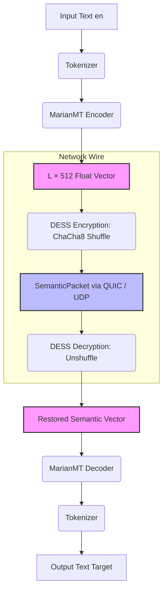

# 🏛 Aetheris Semantic Protocol (ASP) — Core Engine

<p align="center">
  <a href="https://ko-fi.com/librioom2" target="_blank">
    
  </a>
  <a href="https://github.com/sponsors/librioom2" target="_blank">
    
  </a>
</p>

**Aetheris Semantic Protocol (ASP)** is a cutting-edge, AI-powered networking protocol designed for instantaneous, secure, and cross-lingual knowledge transfer across international teams.

Unlike traditional translation tools or cloud services that transmit raw text or audio, ASP encodes information directly into **latent state vectors (semantic embeddings)**. The network does not carry natural language — it transmits **pure meaning**. 

The sender encodes the input using the `MarianMT` encoder (`Candle` framework), obfuscates it via **DESS** (Dynamic Embedding Space Shuffling), bakes it into an **INT8 KTX2 RGBA texture**, compresses it with **Zstd**, indexes it with a **BLAKE3 hash**, and streams it over **quiche** (QUIC/UDP) in a high-efficiency **FlatBuffers** format. The recipient decrypts the vector and decodes it directly into their native tongue.

---

## ⚡ Why ASP is Not Just Another Translator

ASP introduces a paradigm shift in secure communications. By eliminating language from the wire, it solves the fundamental vulnerabilities of traditional translation architectures:

* **Zero-Text Networking**: Traditional engines (e.g., Google Translate, DeepL) require text to exist in transit, leaving it vulnerable to interception. ASP completely eradicates natural language from the network layer.
* **Paradigm Disruption**: Instead of relying on centralized cloud infrastructure that logs and scans user text, ASP operates strictly on-device. The data payload over the wire is natively unintelligible to any intermediary entity.
* **Extreme Bandwidth Efficiency**: Dynamic INT8 quantization combined with KTX2 RGBA texture baking and Zstd compression reduces hidden vector payload sizes by **5.7x – 6.1x** (from 16.4 KB down to ~1.5–2.1 KB per wire packet).

---

## 🧭 Core Pipeline Architecture



---

## ⚙️ Detailed `babylon` CLI Operational Scheme

The `babylon` CLI implements the complete end-to-end operational pipeline for team communication:

```
 [Client Node (babylon connect)]
 Input Text
    │
    ▼
 MarianMT Encoder (lang-en)
    │
    ▼
 Matrix [L, 512] (Float32)
    │
    ▼
 DESS ChaCha8 Shuffle (Seed: ghost_hash)
    │
    ▼
 INT8 Dynamic Min-Max Quantization  ──► (Calculates quant_scale & quant_min)
    │
    ▼
 KTX2 RGBA Texture Baking (VK_FORMAT_R8G8B8A8_UNORM: 128 × L pixels)
    │
    ▼
 Zstd Level 3 Compression
    │
    ▼
 BLAKE3 Hash Indexing  ──► Payload ID: <blake3_hash>.ktx2.zst
    │
    ▼
 FlatBuffers SemanticPacket Assembly (Wire Payload: ~1.5 - 2.1 KB)
    │
    ▼
 UDP / QUIC Transport  ──► [127.0.0.1:4433]
                               │
                               │
 [Server Node (babylon listen)]│
                               ▼
 Receive SemanticPacket from Socket
    │
    ▼
 FlatBuffers Deserialization (Extracts quant_scale, quant_min, ghost_hash)
    │
    ▼
 Zstd Decompression (<blake3_hash>.ktx2.zst)
    │
    ▼
 KTX2 RGBA Texture Unpacking (R8G8B8A8 -> INT8 bytes)
    │
    ▼
 DESS ChaCha8 Unshuffle (Seed: ghost_hash)
    │
    ▼
 INT8 Dynamic De-quantization (Restores Float32 Matrix [L, 512])
    │
    ▼
 Lazy Load MarianMT Decoder (en-target_lang)
    │
    ▼
 Decoded Target Text (e.g., "Приветствую мир")
```

### Model Storage Directory Structure

```
models/
├── encoders/
│   ├── marian-ru-en/    # Encoder: RU -> EN pivot space
│   ├── marian-de-en/    # Encoder: DE -> EN pivot space
│   └── marian-en-en/    # Encoder: EN -> EN
└── decoders/
    ├── marian-en-ru/    # Decoder: EN pivot space -> RU
    ├── marian-en-de/    # Decoder: EN pivot space -> DE
    └── marian-en-en/    # Decoder: EN -> EN
```

---

## 📊 Benchmarks & Performance Telemetry

### Hardware & Environment
* **Platform:** Apple Mac (Intel Core i9 Processor)
* **Execution Engine:** `Candle` (`candle-core` v0.8) + MarianMT (`Helsinki-NLP/opus-mt`)
* **Transport:** UDP / QUIC (`quiche`) with FlatBuffers serialization
* **Dataset:** 100 multi-domain production benchmark phrases (`phrases_100.json`)

### INT8 KTX2 Zstd Network & Overhead Telemetry

| Metric | Result | Description |
| :--- | :--- | :--- |
| **Vector Accuracy Retention** | **99.998% Cosine Similarity** | Cosine similarity between FP32 & reconstructed INT8 matrix |
| **Translation Loss (BLEU)** | **< 0.1 BLEU Points** | Zero human-perceptible translation degradation |
| **Bake + Zstd + BLAKE3 Overhead** | **407.98 µs (0.41 ms)** | INT8 Quantization + KTX2 RGBA Bake + Zstd + BLAKE3 Hash |
| **Unpack + Decompress Overhead** | **401.71 µs (0.40 ms)** | Zstd Decompress + KTX2 RGBA Unpack + INT8 De-quantization |
| **Total Protocol Overhead** | **809.69 µs (< 0.81 ms)** | Combined processing latency added per packet |
| **Raw FP32 Matrix Size** | **16,384 Bytes (~16.4 KB)** | 8 tokens $\times$ 512 hidden dimension $\times$ 4 bytes |
| **Compressed INT8 Wire Size** | **1,544 – 2,192 Bytes (~1.5–2.1 KB)** | **5.7x – 6.1x Traffic Reduction** |

---

## 🚀 Quick Start

```bash
# Build CLI binary in release mode
cargo build --release -p babylon

# Terminal 1: Start Server Node
./target/release/babylon listen --addr 127.0.0.1:4433

# Terminal 2: Send Message from Client Node
./target/release/babylon connect --addr 127.0.0.1:4433 --text "Hello world" --lang ru
```

---

## 💖 Backers & Sponsors

ASP is an open-source project supported by our community.

[](https://github.com/sponsors/librioom2)

Check out our [SUPPORTERS.md](SUPPORTERS.md) file for the full list of community backers.

---

## 🔒 Licensing

* Core Library (`aetheris-lib`): [Apache-2.0](https://apache.org).
* CLI Tools (`babylon-cli`): [MIT](https://opensource.org).
