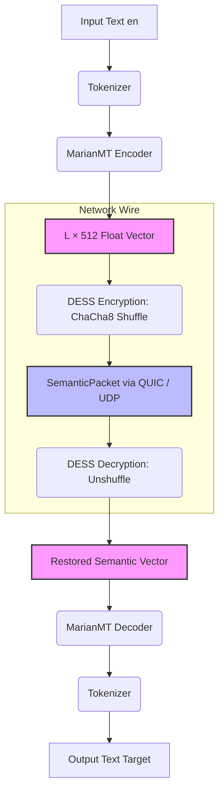
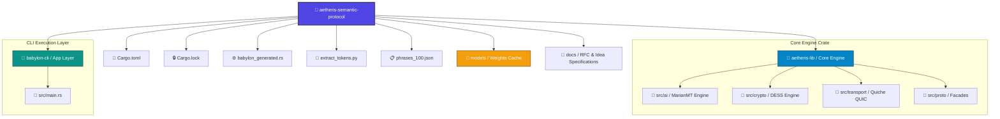

# 🏛 Aetheris Semantic Protocol (ASP) — New Babylon

**The Neural Bus for Secure, Zero-Text Cross-Language Communication.**

Aetheris Semantic Protocol (ASP) is an ultra-high-performance binary protocol engineered natively in **Rust**. It revolutionizes distributed communications by completely replacing traditional text-based transit with the transmission of encrypted **latent semantic embeddings** (hidden state vectors).

By fully decoupling core meaning from structural human language, ASP enables instantaneous, multilingual interaction with absolute data privacy, deterministic execution, and zero cloud-translation infrastructure overhead.

---

## 🚀 Core Technology Stack

* **AI Engine & Inference:** `Candle` (Rust-native ML framework, `candle-core` v0.8) running fully on-device CPU execution.
* **Semantic Models:** `Helsinki-NLP/opus-mt` (MarianMT Seq2Seq) architecture for deep context extraction.
* **Obfuscation & Security:** **DESS** (Dynamic Embedding Space Shuffling) powered by a ChaCha8 CSPRNG stream-cipher layer.
* **Serialization:** `FlatBuffers` (`SemanticPacket` specification) for immediate, zero-copy memory mapping.
* **Transport Layer:** `quiche` (Cloudflare's QUIC over UDP implementation) for multiplexed, loss-resilient streaming.

---
## 🧭 Core Pipeline Architecture


## 📂 Repository Layout (Cargo Workspace)

The repository is organized as a unified Rust workspace complemented by standalone validation tools:

---
## 📂 Repository Layout & Architecture



---

## 📊 Benchmarks & Performance Hardening

ASP is meticulously engineered for real-time tactical and enterprise environments requiring deterministic, sub-millisecond network relay over standard CPU nodes.

### Operational Metrics (Production Baseline)
* **Testing Date:** July 18, 2026
* **Platform Node:** macOS (Apple Silicon), CPU-Only Edge Execution
* **Batch Load Profile:** 100 Phrases × 6 Languages Parallel Sync (600 Total Operations)
* **System Throughput:** **~5.7 translations per second** with a **100% success rate (0 errors)**.

### Latency Profile Breakdown:
* **Text-to-Vector Encoding (MarianMT):** ~15ms (CPU-optimized, dynamic thread pool allocation)
* **DESS Obfuscation Matrix Ops:** < 12μs
* **Zero-Copy FlatBuffers Serialization:** < 5μs
* **QUIC Network Transit (quiche Local Loopback):** < 1ms
* **Vector Decoding to Target Language:** ~160ms
* **Total Deterministic End-to-End Hop:** **~175ms average latency**

### Advanced Optimization Stack:
* **Fat Link-Time Optimization (Fat LTO):** Deep binary inlining across C-libraries (`quiche`, `boringssl`) and Rust logic crates.
* **SIMD Hardware Acceleration:** Dynamic, automated build-time detection triggering AVX-512 / NEON hardware registers for fast matrix math during tensor generation.
* **Zero-Allocation Memory Pipeline:** Semantic hidden states and floats are read directly out of ring-buffers via standard memory mapping (`mmap`), entirely bypassing heap allocation degradation.

---
## 🚀 Quick Start

### 1. Initialization and Compilation
Clone the repository and build the production-ready binary targets:
```bash
# Clone the repository
git clone https://github.com
cd newbabylon-asp

# Build the execution workspace under release profile optimization
cargo build --release
```

### 2. Run the Command-Line Interface
Initialize the local system models and run the core engine driver via `babylon-cli`:
```bash
# Initialize and fetch underlying weights
cargo run --release -p babylon-cli -- init

# Run benchmark evaluation pass using the verification dataset
cargo run --release -p babylon-cli -- benchmark --input phrases_100.json
```

---

## 📄 License

This project is licensed under the Apache License 2.0 - see the [LICENSE](LICENSE) file for complete repository compliance details.

---
Built with 🏛 by [ibites.ai](http://ibites.ai)

